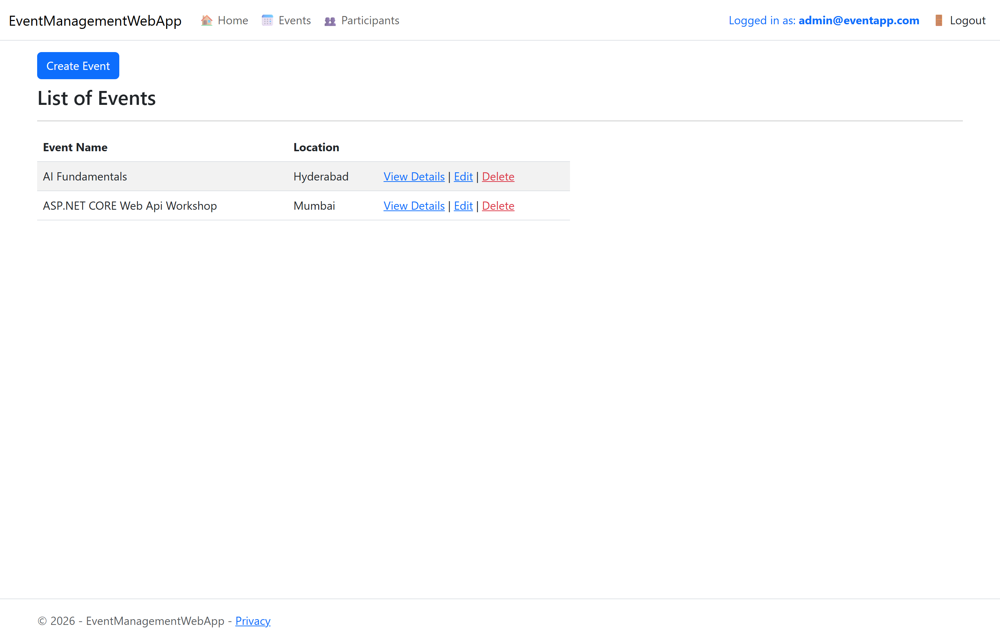
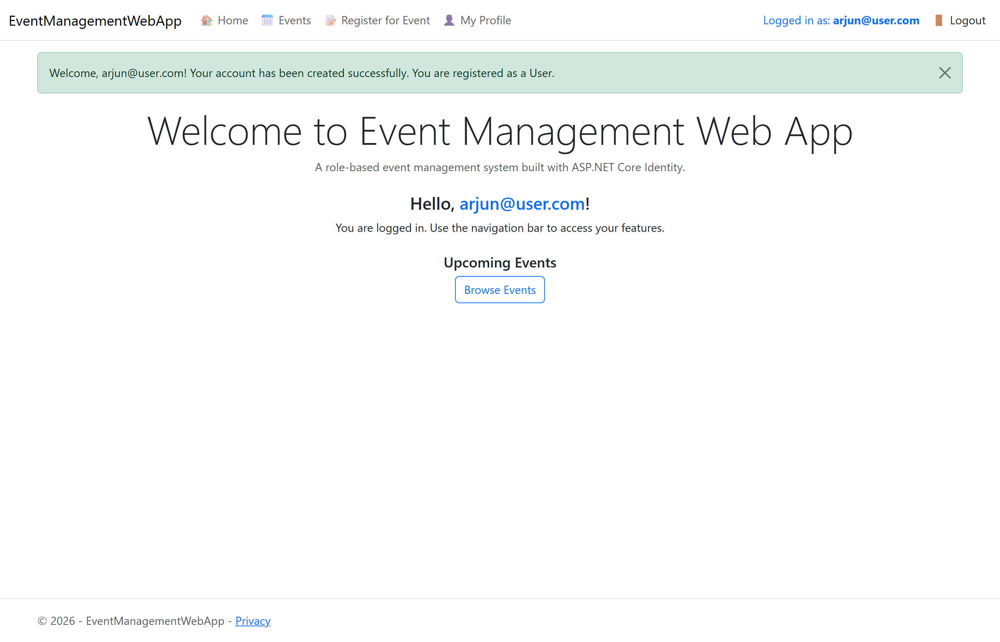
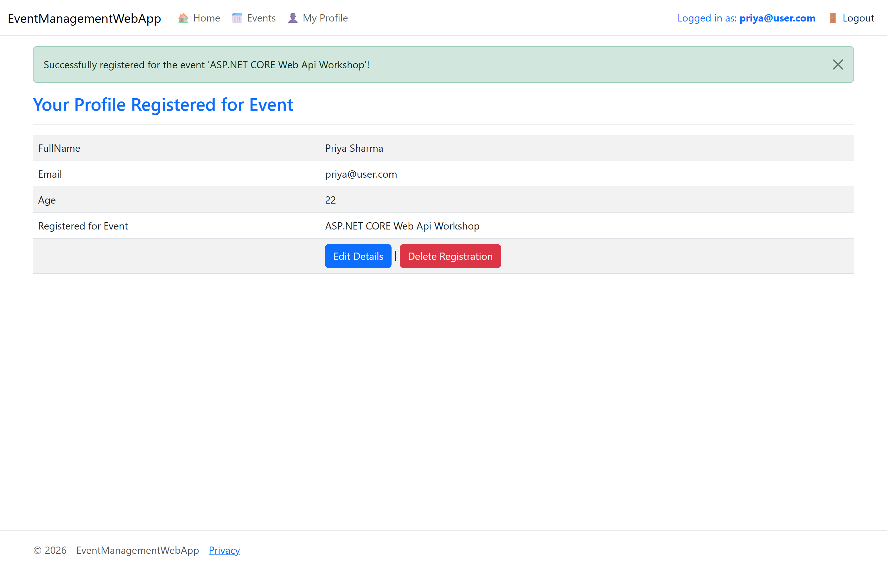
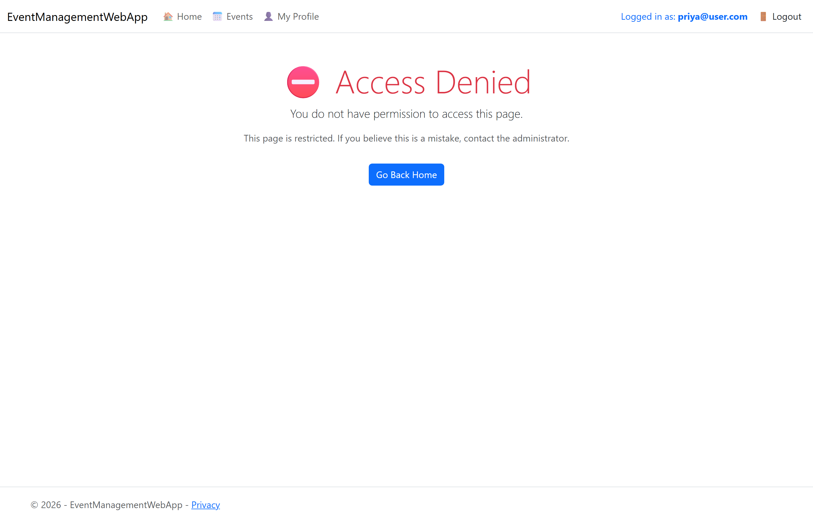

# ⏪ Version 1 — Event Management Web App (superseded)

> **This is the first iteration of the Authentication & Authorization assignment, kept for reference.**
> The improved second iteration — the Student Registration Web App in the [repository root](../README.md) — is the final version. See [Version History](../README.md#version-history) for what changed and why.

ASP.NET Core 8 MVC app with ASP.NET Core Identity on an **Event Management** domain: **Admin** manages Events and views Participants, **User** registers for one event and manages their own profile.

## Screenshots

| | |
|---|---|
|  |  |
| *Admin: Events with Create/Edit/Delete + Participants list* | *User: welcome message, role-based menu, email in navbar* |
|  |  |
| *One-event registration with success message* | *Access Denied when a User opens an admin URL* |

## What's different from V2

- Domain: Events + Participants (V2: Courses + CourseRegistrations)
- Roles: Admin / **User** (V2: Admin / **Student**, matching the assignment sheet)
- Login/Register via **Identity Razor Pages** in `Areas/Identity` (V2: custom MVC `AccountController`)
- Profile data in a separate `Participants` table linked by email (V2: fields on the extended `ApplicationUser`)
- "User" role assigned on first Home-page visit (V2: assigned at registration)
- One-registration rule checked in code only (V2: unique database index)
- Two DbContexts — `EventDbContext` + `AppIdentityDbContext` (V2: one context)

## Run it

.NET 8 SDK + SQL Server LocalDB, then from this folder: `dotnet run` — the database (`EventManagementWebApp`), roles, admin account, and two sample events create themselves on first start.

**Admin:** `admin@eventapp.com` / `Admin@123` · Users register via the Register page.

## Docs

- [`docs/EventManagementWebApp_Auth_Assignment_Submission.docx`](docs/EventManagementWebApp_Auth_Assignment_Submission.docx) — full V1 submission (screenshots + source)
- [`docs/EventManagementWebApp_Complete_SourceCode.docx`](docs/EventManagementWebApp_Complete_SourceCode.docx) — the original class source-code document V1 was built from
